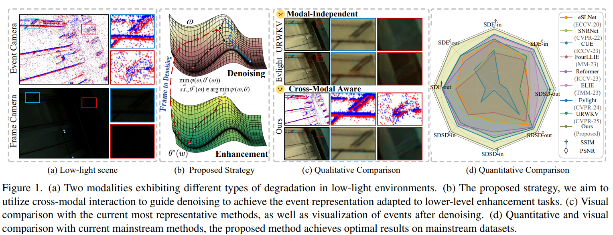
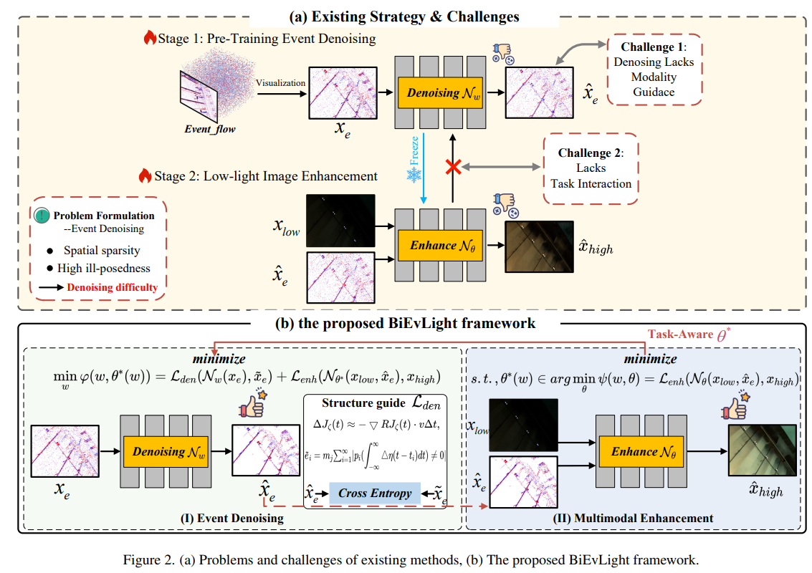
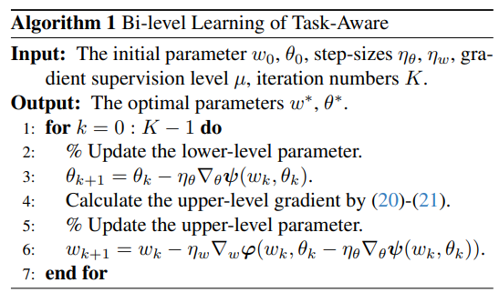
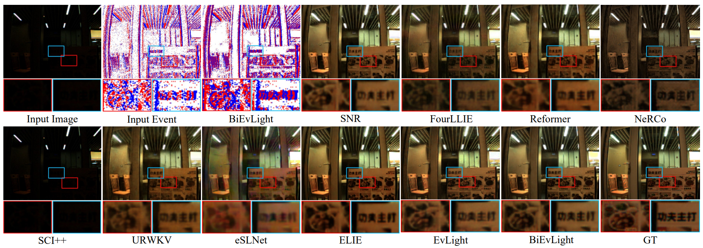
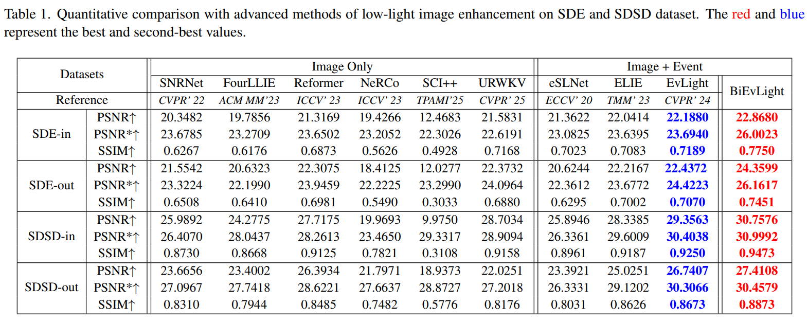

# BiEvLight 

Official PyTorch implementation for the " BiEvLight: Bi-level Learning of Task-Aware Event Refinement for Low-Light Image Enhancement" (CVPR 2026).

<p align="center">
    <b>BiEvLight</b>:
    🌐 <a href="xxx" target="_blank">Project</a> | 📃 <a href="https://arxiv.org/abs/2603.04975" target="_blank">Paper</a> | 🖼️ <a href="./img/poster.pdf" target="_blank">Poster</a> <br>
</p>

<p align="center">
    
</p>


**Authors**: [Zishu Yao](https://iijjlk.github.io/)<sup>[:email:️](mailto:zishuyao98@gmail.com)</sup>, Xiang-Xiang Su, Shengning Zhou, Guang-Yong Chen, Guodong Fan, Xing Chen, **Fu Zhou University**

**Feel free to ask questions. If our work helps, please don't hesitate to give us a :star:!**


## :rocket: News
<!-- - [ ] Provide a script for inference on the user's own video -->

- [x] 2026/03/05: Initialize the repository.
- [x] 2026/02/21: :tada: :tada: Our paper was accepted in CVPR'2026.
- [x] 2026/8/15 Test set results are now available ([link](https://drive.google.com/file/d/1GWCIK1cW5TbBiJs8OwUqv0oTQAUSocnd/view?usp=drive_link)).
- [x] 2026/9/20 Test Code are now available.
## :bookmark: Table of Content

1. [Code](#Code)
2. [Methods](#Methods)
3. [Results](#Results)
3. [Citation](#Citation)
3. [Contact](#contact)
4. [License and Acknowledgement](#license-and-acknowledgement)


## Code

```
python test.py --opt ./Options/BiEvLight_inference.yml
```

## Methods

<p align="center">
    
</p>

## Algorithm
<p align="center">
    
</p>

## Results


### Qualitative Comparison
<p align="center">
    
</p>

### Quantitative Comparison
<p align="center">
    
</p>


## Citation

If you find this work useful, please consider citing:
```bibtex
@InProceedings{Yao_2026_CVPR,
    author    = {Yao, Zishu and Su, Xiang-Xiang and Zhou, Shengning and Chen, Guang-Yong and Fan, Guodong and Chen, Xing},
    title     = {BiEvLight: Bi-level Learning of Task-Aware Event Refinement for Low-Light Image Enhancement},
    booktitle = {Proceedings of the IEEE/CVF Conference on Computer Vision and Pattern Recognition (CVPR)},
    month     = {June},
    year      = {2026},
    pages     = {41541-41550}
}
```


## :email: Contact

For any questions or discussions, please feel free to contact:

- Zishu Yao: [Homepage](https://iijjlk.github.io/) | [Email](mailto:zishuyao98@gmail.com)

## :scroll: License and Acknowledgement

This project is released under the MIT License.

We thank the open-source community for their valuable contributions.
